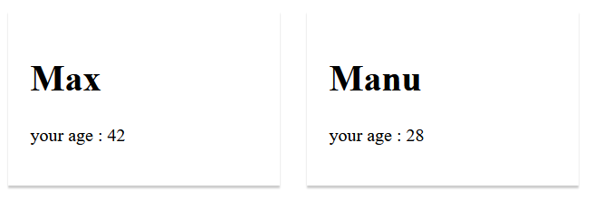
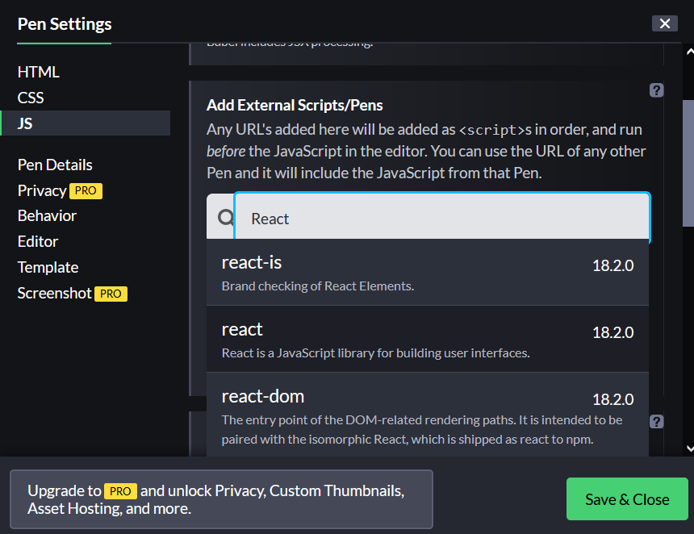
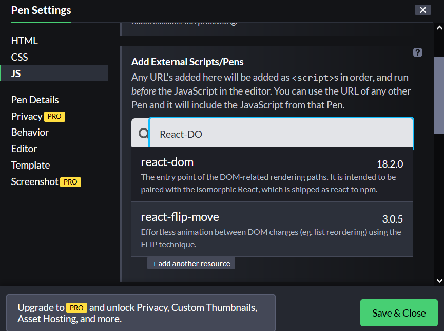
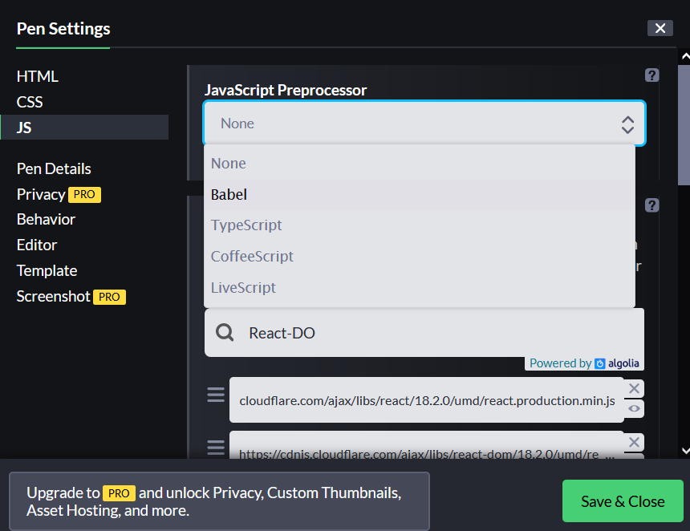
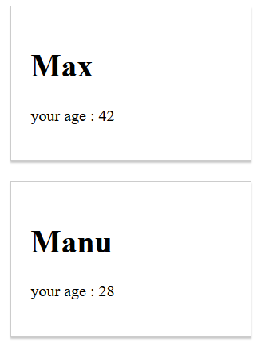

# REACT JS

## I. Prerequis: 
Au début rien.

## II. Premier code motivant React

### 2.1 Code html/css classique
Nous allons utiliser codepen.io (penser à ouvrir un compte pour pouvoir enregistrer les avancements). J'ai commencé à créer un code html comme dans la partie `html`

```html
<div class="person">
  <H1>Max</H1>
  <p>your age : 42</p>
</div>

<div class="person">
  <H1>Manu</H1>
  <p>your age : 28</p>
</div>
```
et la classe `".person"` est implémentée en `"css"` comme suit:

```css
.person{
  display: inline-block;
  margin: 10px;
  border: 1px solid #ccc;
  box-shadow: 0 2px 2px #ccc;
  width: 200px;
  padding: 20px;
}
```
Sur codepen, je devrais avoir ceci:


La sortie devrait nous donner ceci:



### 2.2 Rajout des librairies React.js et ReactDOM
Pour l'instant, aucun code React mais on comprend que les différents tags `<div>`sont toujours structuré de la même manière et donc on pourrait "eventuellement" automatiser la création d'un composant `<div>`comme ce que nous avons ci-dessus. En effet, React permet par exemple de créer des composants réutilisables et paramétrables.

Essayons de rajouter un petit parfum de `React` alors.
La première chose à faire est d'aller importer la librairie `React.js` en cliquant (dans codepen.io) sur le bouton `settings`.
.

Et donc dans l'interface qui s'affiche, dans la partie JS, choisir `React`et choisir la dernière version qui s'affiche.



Et cliquez `save and close`

De la même manière rajoutez `ReactDOM`



Enfin, comme React, n'utilises pas seulement le javascript classique mais des versions nouvelles, il faut choisir dans la partie `Javascript preprocessor`, la version `Babel` (plus tard, nous le comprendrons)



### 2.3 Creation d'un composant React
Nous allons convertir le `<div>` que nous avions en un composant React. 
Dans la partie `JS` de codepen, commençons par créer une fonction que nous allons nommer `Person`. Dans cette function, nous allons juste retourner le code complet du `<div>` (la syntaxe de ce code retourné est appelé `jsx` - https://fr.reactjs.org/docs/introducing-jsx.html - une sorte de mélange entre du html et du js). Ce JSX ne fonctionnerait pas si nous n'avions pas choisi `Babel` dans les preprocesseurs.

```js
function Person(){
  return (
    // code JSX à insérer ici    
  );
}
```

Le code devient alors comme ceci:

```js
function Person(){
  return (
    <div class="person">
      <H1>Max</H1>
      <p>your age : 42</p>
    </div>
  );
}
```
Créer la fonction n'est pas suffisante, bien, sûr et il faut maintenant faire le rendu du JSX. Pour cela, il faut utiliser `ReactDOM.render()` (en gros, cela permet de faire le rendu [afficher], une fonction qui retourne un JSX comme un composant, en le spécifiant comme un tag html - ici ce sera le tag `<Person />`).

La fonction `render()`, prend deux arguments:
* le premier est l'objet JSX (le tag correspondant au nom de la fonction)
* le deuxième est l'endroit où on veut faire le rendu dans le HTML.

Avant de donner la syntaxe, nous allons d'abord modifier un peu le HTML, pour créer un tag `<div id="p1"></div>` qui est vide et qui nou servira à afficher notre JSX.

Le code HTML devient alors comme ceci:

```html
<div id="p1"></div>

<div class="person">
  <H1>Manu</H1>
  <p>your age : 28</p>
</div>
```
Maintenant, nous allons rajouter, dans le JS, le code qui permettra de faire le rendu de la fonction `Person` dans le `<div id="p1">` qui initialement est vide (pas de contenu).

Rajouter dans le code JS
```js
function Person(){
  return (
    <div class="person">
      <H1>Max</H1>
      <p>your age : 42</p>
    </div>
  );
}

// rajouter la fonction render
ReactDOM.render(<Person/>, document.querySelector("#p1"));
```
* `<Person />`: on a dit que le JSX doit être spécifié comme un tag HTML
* le lieu où on veut faire l'affichage (le rendu) est dans le div dont l'identifiant est `p1` (rappel de l'utilisation de `querySelector`: https://developer.mozilla.org/en-US/docs/Web/API/Document/querySelector)

remarque: sur d'ancienne version de React, le style pourrait être perdu car `class` est un mot clé Java et donc dans le JSX, il faudra le remplacer par `className`comme ceci:

```js
function Person(){
  return (
    <div className="person">
      <H1>Max</H1>
      <p>your age : 42</p>
    </div>
  );
}

// rajouter la fonction render
ReactDOM.render(<Person/>, document.querySelector("#p1"));
```

Le résultat est:


