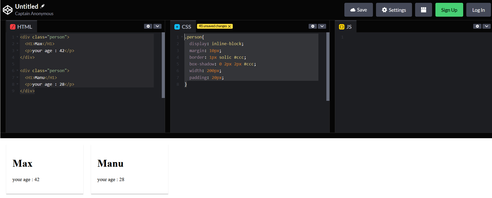

# REACT JS

## I. Prerequis: 
Au début rien.

## II. Premier code motivant React

### 2.1 Code html/css classique
Nous allons utiliser codepen.io (penser à ouvrir un compte pour pouvoir enregistrer les avancements). J'ai commencé à créer un code html comme dans la partie `html`

```html
<div class="person">
  <H1>Max</H1>
  <p>your age : 42</p>
</div>

<div class="person">
  <H1>Manu</H1>
  <p>your age : 28</p>
</div>
```
et la classe `".person"` est implémentée en `"css"` comme suit:

```css
.person{
  display: inline-block;
  margin: 10px;
  border: 1px solid #ccc;
  box-shadow: 0 2px 2px #ccc;
  width: 200px;
  padding: 20px;
}
```
Sur codepen, je devrais avoir ceci:



La sortie devrait nous donner ceci:


### 2.2 Rajout des librairies React.js et ReactDOM
Pour l'instant, aucun code React mais on comprend que les différents tags `<div>`sont toujours structuré de la même manière et donc on pourrait "eventuellement" automatiser la création d'un composant `<div>`comme ce que nous avons ci-dessus. En effet, React permet par exemple de créer des composants réutilisables et paramétrables.

Essayons de rajouter un petit parfum de `React` alors.
La première chose à faire est d'aller importer la librairie `React.js` en cliquant (dans codepen.io) sur le bouton `settings`.
.

Et donc dans l'interface qui s'affiche, dans la partie JS, choisir `React`et choisir la dernière version qui s'affiche.


Et cliquez `save and close`

De la même manière rajoutez `ReactDOM`


Enfin, comme React, n'utilises pas seulement le javascript classique mais des versions nouvelles, il faut choisir dans la partie `Javascript preprocessor`, la version `Babel` (plus tard, nous le comprendrons)


### 2.3 Creation d'un composant React
Nous allons convertir le `<div>` que nous avions en un composant React. 
Dans la partie `JS` de codepen, commençons par créer une fonction que nous allons nommer `Person`. Dans cette function, nous allons juste retourner le code complet du `<div>` (la syntaxe de ce code retourné est appelé `jsx` - https://fr.reactjs.org/docs/introducing-jsx.html - une sorte de mélange entre du html et du js). Ce JSX ne fonctionnerait pas si nous n'avions pas choisi `Babel` dans les preprocesseurs.

```js
function Person(){
  return (
    // code JSX à insérer ici    
  );
}
```

Le code devient alors comme ceci:

```js
function Person(){
  return (
    <div class="person">
      <H1>Max</H1>
      <p>your age : 42</p>
    </div>
  );
}
```
Créer la fonction n'est pas suffisante, bien, sûr et il faut maintenant faire le rendu du JSX. Pour cela, il faut utiliser `ReactDOM.render()` (en gros, cela permet de faire le rendu [afficher], une fonction qui retourne un JSX comme un composant, en le spécifiant comme un tag html - ici ce sera le tag `<Person />`).

La fonction `render()`, prend deux arguments:
* le premier est l'objet JSX (le tag correspondant au nom de la fonction)
* le deuxième est l'endroit où on veut faire le rendu dans le HTML.

Avant de donner la syntaxe, nous allons d'abord modifier un peu le HTML, pour créer un tag `<div id="p1"></div>` qui est vide et qui nou servira à afficher notre JSX.

Le code HTML devient alors comme ceci:

```html
<div id="p1"></div>

<div class="person">
  <H1>Manu</H1>
  <p>your age : 28</p>
</div>
```
Maintenant, nous allons rajouter, dans le JS, le code qui permettra de faire le rendu de la fonction `Person` dans le `<div id="p1">` qui initialement est vide (pas de contenu).

Rajouter dans le code JS
```js
function Person(){
  return (
    <div class="person">
      <H1>Max</H1>
      <p>your age : 42</p>
    </div>
  );
}

// rajouter la fonction render
ReactDOM.render(<Person/>, document.querySelector("#p1"));
```
* `<Person />`: on a dit que le JSX doit être spécifié comme un tag HTML
* le lieu où on veut faire l'affichage (le rendu) est dans le div dont l'identifiant est `p1` (rappel de l'utilisation de `querySelector`: https://developer.mozilla.org/en-US/docs/Web/API/Document/querySelector)

remarque: sur d'ancienne version de React, le style pourrait être perdu car `class` est un mot clé Java et donc dans le JSX, il faudra le remplacer par `className`comme ceci:

```js
function Person(){
  return (
    <div className="person">
      <H1>Max</H1>
      <p>your age : 42</p>
    </div>
  );
}

// rajouter la fonction render
ReactDOM.render(<Person/>, document.querySelector("#p1"));
```

Le résultat est:


### 2.4 Paramètre d'un composant (ou props)
Dans l'exemple d'avant, nous avons un composant figée (nom Max, Age 48). Ce serait bien de pouvoir les paramétrer pour créer d'autres composants. Pour cela, nous allons utiliser le concept de `props` (pour "properties").

Comment utiliser les `props`pour pouvoir fixer des arguments?
Comme dans tout appel de fonction, les valeurs des arguments sont fixés lors de l'appel. Il nous faut modifier le code de la fonction comme suit:

```js
function Person(props){
  return (
    <div className="person">
      <h1>{props.name}</h1>
      <p>{props.age}</p>
    </div>
  );
}
```

Cela signifie que nous avons défini deux propriétés (ou arguments), `name` et `age`. Remarquez la syntaxe avec une seule paire d'accolage `{props.name}` et `{props.age}`.

L'appel se fera en spécifiant cette fois-ci la valeur que nous souhaiterons donner à ces `props`que nous venons de définir, comme ceci:

et le code d'appel sera

```js
ReactDOM.render(<Person name="Patrick" age="42"/>,
                document.querySelector('#p1'));
```

Mes nouveaux codes:
* rajout d'un nouvel id en HTML (id="p2")
* Appel de render deux fois sur deux instances du composants avec des arguments différents.


On remarquera que l'affichage n'est pas comme on l'a spécifié dans le CSS (inline ou en ligne) mais plutôt en bloc (ou passer à la ligne après chaque affichage - c'est à cause du fait qu'un div est toujours par défaut en affichage block et que le fait de faire le rendu sur 2 div différent, force le html à aller à la ligne (affichage block) même si on l'a spécifié dans le css qu'on voulait un inline)

### 2.5 Application au sens React
Dans l'exemple précédent, nous appelions deux fois la fonction `ReactDOM.render()` pour afficher deux fois le composant.
Pour éviter cela, nous allons modifier notre HTML pour ne pas avoir `id="p1"`et `id="p2"`. Nous allons juste mettre un seul id, appelé arbitrairement `app`.

```html
<div id="app"></div>
```

Nous allons modifier le js en rajoutant une instanciation d'une variable ui contiendra un JSX avec plusieurs instanciation du composant `<Person ... .../>`

```js
function Person(){
  return (
    <div className="person">
      <H1>Max</H1>
      <p>your age : 42</p>
    </div>
  );
}

// rajouter la variable app (ou autre nom)
var mavarJSX =(
  <div>
      <Person name="Patou" age="42"/>
      <Person name="André" age="95"/>
      <Person name="Luc" age="105"/>
  </div>
)
// modifier l'appel afin qu'on n'ait plus qu'un seul render, mais qui rend pas une instance du composant mais la variable qui contient le JSX dans le nouveau div que nous souhaitons utiliser (app)
ReactDOM.render(mavarJSX, 
                document.querySelector('#app'));
```

Le résultat est:


## 3. Prévue de la suite:

Ci-dessous la liste des sujets à travailler dans ce cours. 


## 4.Javascript de nouvelle génération (optionnel)
Il est important de connaître le JS de nouvelle generation (ex: ES6, Arrow function,...) car React est écrit avec ces nouveautés. Dans cette partie, nous allons revoir vite fait ces élements de langage. 
Cette partie est facile à trouver partout sur internet donc elle ne sera pas très détaillé (mais ce serait bien de finir les challenges)

### 4.1 Comprehension de let et const
`let`, `var` et `const` sont des manières de créer des variables en JS. `let` et `const` ont été introduits dans ES6. 
Comme leur nom l'indique, utiliser `let` pour déclarer des variables et `const`pour déclarer des constantes (affectée une fois et ne change plus). 

Des documents sont à voir [ici](https://www.hackerrank.com/challenges/js10-let-and-const/topics) et des [challenges](https://www.hackerrank.com/challenges/js10-let-and-const/problem?isFullScreen=true) (il faudra ouvrir un compte sur hackerrank.com) 

Exercice: faire le challenge Day0 et Day1 dans hackerrank [10 Days of JS](https://www.hackerrank.com/domains/tutorials/10-days-of-javascript)

### 4.2 Les fonctions fléchées (arrow-functions)
C'est une nouvelle manière d'écrire des fonctions en JS. 

La documentation synthétique est [ici](https://www.hackerrank.com/challenges/js10-arrows/topics) et le challenge est de faire le [Day5]((https://www.hackerrank.com/challenges/js10-arrows/problem?isFullScreen=true) de [10 Days of JS].

D'autres [documentations](https://www.w3schools.com/js/js_arrow_function.asp).

### 4.3 Les imports  et exports
 
Les tutos sur ces éléments de langages sont [ici](https://javascript.info/import-export).

NOTE: A regarder spécialement les notions suivantes:
* `export/import as`
* `export default` 
* `import` (avec {} et sans {})
* `import *` (comme en Java)
* Comment importer des éléments exportés avec `export default` (les noms par défaut, les exports sans noms)
* importer plusieurs éléments différents d'un fichier

Et bien sûr si tout n'est pas clair, voir d'autres tutos pour affiner.

Attention: Tous les navigateurs ne supportent pas toujours les fonctionalités des JS de nouvelle génération.  

### 4.4 Les classes en JS
Idem, nous ne nous attarderons pas, il faudra regarder d'autres cours (ex: [w3schools_inheritance](https://www.w3schools.com/js/js_class_inheritance.asp)). 


Les points à regarder en particuler:
* comment instancier une classe
* l'héritage en JS
* les constructeurs en JS - comment appeler un constructeur en cas d'héritage ou de redéfinition du constructeur (la notion de `super()` comme en C++ ou Java)


Exemple: 
```js
class Person {
  // déclaration d'un constructeur
  constructor(){
    // donne une propriétée de la classe
    this.name = "Patou";
  }

  printName(){
    console.log(this.name);
  }

} 

// instanciation de la classe
const pers = new Person();
person.printName();
``` 

On pourrait créer une classe `Human` et en faire hériter `Person`. 
```js
class Human{
  constructor(){
    this.gender='male';
  }
  printGender(){
    console.log(this.gender);
  }
}
// fait hériter Person de Human
// ce qui donne toutes les props et les
// méthodes de Human à Person
class Person extends Human{
  // déclaration d'un constructeur
  constructor(){
    // en cas de redéfinition du 
    // constructeur en cas d'héritage
    super();
    // donne une propriétée de la classe
    this.name = "Patou";
  }

  printName(){
    console.log(this.name);
  }

} 

const pers = new Person();
pers.printName();
// fonctionne car Person hérite de Human
pers.printGender();
```
Tester ce code sur 
Les classes sont importants car elles peuvent être utilisées pour modéliser la notion de des composants au sens React.

### 4.5 Les propriétés et les méthodes de classes
Il est possible de rajouter à la volée des `props` et des `méthodes` à la classe à la volée, directement dans la classe sans le mettre (comme auparavant) dans le constructeur.
Nous allons illustrer l'exemple suivant en le convertissant en classe de JS de nouvelle gen. 

```js
class Human{
  // plus besoin de constructor
  gender = 'male';
  // la fonction a été remplacé par la nouvelle syntaxe
  printGender=()=>{
    console.log(this.gender);
  }
}
 
class Person extends Human{
  name = "Patou";
  printName= ()=>{
    console.log(this.name);
  }

} 

const pers = new Person();
pers.printName();
pers.printGender()

```
### 4.6 Les opérateurs Spread & Rest

On trouve les infos ici: [spread](https://www.w3schools.com/react/react_es6_spread.asp) (peut s'utiliser pour des objets et des tableaux), et l'opérateur [rest](https://mindsers.blog/fr/post/rest-parameter-et-spread-operator-en-javascript/) (pour avoir des fonctions avec nombre variables d'arguments - en C++ cela equivaut aux variadiques)

Ex:
```js
const numbers =[1,2,3,4];
const newNb=[0,...numbers,5,6,7,8]
console.log(newNb);
```
Donne une sorti comme suit:
```sh
[0, 1, 2, 3, 4, 5, 6, 7]
```
En effet, sans l'opérateur `Spread` (les 3 points),  on aurait quelque chose comme suit, ce qui ne serait pas correcte:

```js
const numbers =[1,2,3,4];
const newNb=[0,numbers,5,6,7]
console.log(newNb);
```
```sh
[0, [1, 2, 3, 4], 5, 6, 7]
```

L'opérateur peut fonctionner également sur des objets.

```js 
const person={
 nom:"Patou",
 prenom:"Pat"
};

const newPerson={
 ...person,
 age:28
}
console.log(newPerson);
```
Sortie:
```js
[object Object] {
  age: 28,
  nom: "Patou",
  prenom: "Pat"
}
```

### 4.7 Destructuration
Cette opération consiste à extraire d'une grosse structure ses éléments (ex: tableaux ou objet en variables qui le composent)

La documentation peut se trouver ici: [destructurer](https://www.w3schools.com/react/react_es6_destructuring.asp) et ici [en français](https://developer.mozilla.org/fr/docs/Web/JavaScript/Reference/Operators/Destructuring_assignment#affecter_avec_un_nom_diff%C3%A9rent)

La destructuration fonctionne également pour des objets JS.


### 4.8 Usage par valeur et par référence

Comme en C++, les types primitives sont sujets à des usages par valeur. 

```js
const num1 = 1 ;
// une nouvelle variable qui contient une copie
// de la valeur de num1
const num2 =num1;
```
Ce n'est pas le cas pour les types d'usage par référence. 
```js
const person = {
  name:"Patou"
};
// une nouvelle variable mais qui ne fait que 
// référencer person (ce n'est qu'un pointeur)
const person2= person;
console.log(person.name);
console.log(person2.name);
// je vais changer le nom de person
person.name="Max";
// et je vais réafficher person2
console.log(person2.name);
```

La sortie montre que le nom associé à `person2` est aussi changé. Le type objet a un usage par référence. 

```sh
"Patou"
"Patou"
"Max"
```

Si toutefois, nous souhaitons copier les valeurs de `person` dans `person2` et créer un vrai nouvel objet dans `person2` qui n'est pas un pointeur sur `person`, alors, on peut utiliser l'opérateur `Spread`(vu précédemment).

```js
const person = {
  name:"Patou"
};
// une nouvelle variable mais qui ne fait que 
// référencer person (ce n'est qu'un pointeur)

const person2= person;
// devrait afficher Patou
console.log(person.name);
// devrait afficher Patrou
console.log(person2.name);
// changer le nom de person 
// et réafficher person2
person.name="Max";
// devrait afficher Max car person2 pointe sur 
// person
console.log(person2.name);

// je vais changer le nom de person
const person3 = {
 ...person
}
// changer le nom de person
person.name="Andre";
// et je vais afficher Andre car 
// person2 pointe toujours sur Person
console.log(person2.name);
// affiche toujours "Max" car 
// le nouvel objet est une duplication de person
// originale qui vit maintenant sa vie et n'a /
// pas été modifié
console.log(person3.name);
```
### 4.9 Les méthodes de gestion de tableaux en js

De la documentation ici [tab_array_method](https://waytolearnx.com/2019/06/10-methodes-de-tableau-dans-javascript-a-connaitre.html).


